<h3 align="center">I build AI systems that reason, retrieve, and act — not just autocomplete.</h3>

<p align="center">
<a href="https://www.linkedin.com/in/kundan-gupta-4a0a10378/"></a>
<a href="mailto:kundankumargupta800@gmail.com"></a>
<a href="https://leetcode.com/"></a>
</p>

<br/>

## What I'm actually doing right now

```
🔭  Building     → multi-agent LLM pipelines with LangGraph (planning, tool-use, memory)
🧠  Obsessing    → getting RAG systems to say "I don't know" instead of hallucinating
🌱  Learning     → adversarial robustness & explainability (SHAP) for models people trust
```

Most of what I build tries to answer one question: **how do you make an LLM-based
system reliable enough that someone else would bet on its output?** That's the thread
running through the RAG chatbot, the tool-calling agent, and the research assistant below.

<br/>

## Stack

<div align="center">

</div>

<p align="center"><sub>
Core: <b>Python</b> for everything ML · <b>LangChain / LangGraph</b> for orchestration · <b>FAISS + HuggingFace</b> for retrieval · <b>Streamlit / React</b> to ship a UI fast
</sub></p>

<br/>

## Featured builds

<table>
<tr>
<th align="left">Project</th>
<th align="left">What it does</th>
<th align="left">Why it's interesting</th>
</tr>
<tr>
<td><b><a href="https://github.com/Kundan062/SEARCH-ENGINE">SEARCH-ENGINE</a></b></td>
<td>AI research agent using DuckDuckGo, Wikipedia & ArXiv</td>
<td>UI shows its reasoning live — you watch it pick tools, not just wait for an answer</td>
</tr>
<tr>
<td><b><a href="https://github.com/Kundan062/Document-Q-A">Document-Q-A</a></b></td>
<td>RAG chatbot that answers strictly from uploaded PDFs</td>
<td>FAISS + HuggingFace embeddings, tuned to refuse rather than guess</td>
</tr>
<tr>
<td><b><a href="https://github.com/Kundan062/chatbot-with-tools">chatbot-with-tools</a></b></td>
<td>Conversational agent with real backend tool-calling</td>
<td>Clean separation between reasoning and execution</td>
</tr>
<tr>
<td><b><a href="https://github.com/Kundan062/Churn-Prediction">Churn-Prediction</a></b></td>
<td>Predicts customer churn from behavioral data</td>
<td>Classic ML done right — feature engineering over black-box tuning</td>
</tr>
</table>

<br/>

## Proof of work

<div align="center">


</div>

<br/>

<div align="center">

🏆 Top 15 All-India Finalist, YI BBIC 2.0 (Deep Tech, IIT Madras) &nbsp;·&nbsp; 🏅 2× Smart India Hackathon internal-round winner &nbsp;·&nbsp; 🧮 500+ DSA problems solved

</div>

<br/>

<div align="center">

Open to internships and interesting problems. Fastest way to reach me:
<a href="mailto:kundankumargupta800@gmail.com">email</a> ·
<a href="https://www.linkedin.com/in/kundan-gupta-4a0a10378/">LinkedIn</a>

</div>
